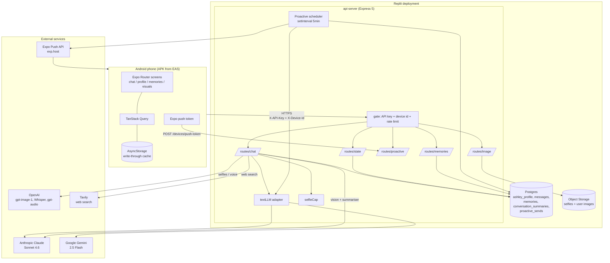
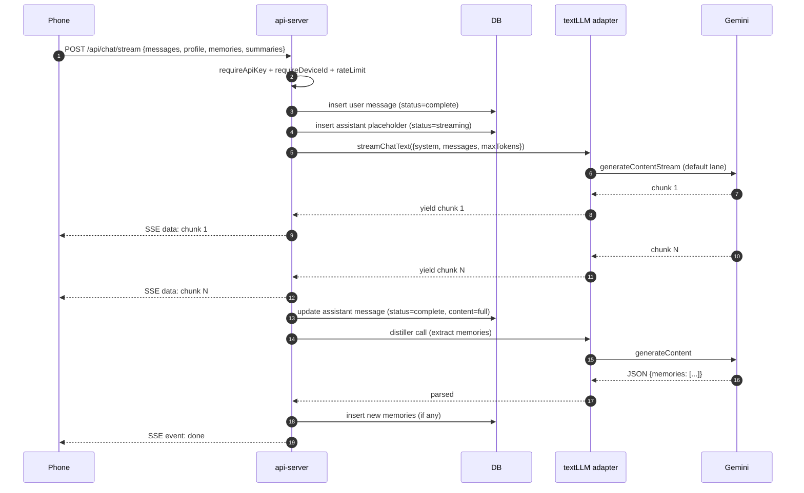

# Ashley-Sidecar — Architecture Reference

Snapshot date: 2026-05-08. Scope: the **Ashley** product only — `artifacts/mobile/` and `artifacts/api-server/`. Safeguard is a separate product and is not covered here.

---

## 0. Plain-English Explanation (read this first)

Ashley is a personal AI companion you carry on your phone. There are two pieces:

1. **The phone app** (`artifacts/mobile`) — an Expo / React Native app shipped as an Android APK via EAS Build. It draws the screens, holds a local copy of your profile, memories, and chat history in phone storage, records voice, plays Ashley's voice back, and shows her selfies.
2. **The server** (`artifacts/api-server`) — an Express 5 backend running on Replit. It owns the database (Postgres), talks to the AI providers, generates the selfies, schedules the proactive "I'm thinking of you" pings, and sends push notifications.

The app and server talk over HTTPS. Every request from the app carries a shared secret (`X-API-Key`) and the device's UUID (`X-Device-Id`) — no usernames, no passwords. Whoever holds the APK is "you".

The interesting design decisions:

- **The phone is a fast cache, the server is the source of truth.** Local storage gives instant boot. Every cold start re-pulls state from the server and overwrites the cache. This is why migrating between devices means importing into the server, not copying files between phones.
- **Three different LLM providers, picked per-job.** Cheap, fast Gemini for chat. Claude for things where wording matters more than cost (long-term memory summarisation, photo replies). OpenAI for everything that's not text (selfies, voice transcription, voice generation).
- **Two-lane proactive scheduler.** Ashley reaches out on her own. "Care" pings (have you eaten, drunk water?) and "Companion" pings (memory nudges, conversation gaps) are governed independently so chitchat can never starve out a wellbeing check.
- **Tight cost ceilings on the expensive bits.** Selfies are capped per device per day. Chat messages are limited by token caps. The chat lane defaults to Gemini.

You own all of the code. You rent the LLM providers, the database, and the hosting. Replacing those is a finite job, documented in §7.

---

## 1. Mobile (Frontend)

### Stack

- **Framework:** Expo SDK 54 (React Native 0.81.5), TypeScript, Expo Router 6.
- **Networking:** `fetch` + TanStack Query.
- **Local storage:** `@react-native-async-storage/async-storage`.
- **UI:** React Native primitives + `expo-image`, `expo-linear-gradient`, `expo-blur`, `expo-symbols`, `react-native-reanimated`, `react-native-gesture-handler`, `react-native-svg`.
- **Native features:** `expo-haptics`, `expo-image-picker`, `expo-location`, `expo-web-browser`, `expo-status-bar`, `expo-splash-screen`, `expo-system-ui`.
- **Distribution:** EAS Build → Android APK. The APK is sideloaded.

### Entry Point

- `package.json` → `"main": "expo-router/entry"`. Expo Router auto-discovers screens in `app/`.
- `app/_layout.tsx` — root layout. Loads Inter font, mounts the TanStack Query provider, runs initial state hydration on cold boot (`fetchState()`), wires global navigation.

### Route Map (`artifacts/mobile/app/`)

| File | Screen | Purpose |
|---|---|---|
| `_layout.tsx` | (root) | Providers + boot hydration |
| `index.tsx` | Home | Animated avatar, status text, CTA into chat |
| `chat.tsx` | Chat | Inverted FlatList, text + voice + image turns, streaming SSE |
| `profile.tsx` | Profile | Persona, relationship/content mode, voice toggle, 18+ gate, backup/restore, push setup |
| `memories.tsx` | Memories | List/edit long-term memories + conversation summaries |
| `visuals.tsx` | Visuals | Gallery of generated selfies + analysed user photos |
| `onboarding.tsx` | Onboarding | First-run setup (mostly auto-skipped in V1.1) |
| `+not-found.tsx` | 404 | Expo Router fallback |

### Mobile lib (`artifacts/mobile/lib/`)

- `aiClient.ts` — HTTP wrapper. Picks base URL from `EXPO_PUBLIC_API_BASE` (production: `https://Ashley-Sidecar.replit.app`) or `EXPO_PUBLIC_DOMAIN` (dev fallback). Injects `X-API-Key` + `X-Device-Id` + `Authorization: Bearer <deviceId>` on every call. Has retry logic that detects Replit dev-server placeholder responses and re-tries.
- `deviceId.ts` — generates and persists a UUID per install. This is the entire identity model.
- `storage.ts` — typed AsyncStorage wrapper.
- `dataMigration.ts` — versioned migrations on local cache.
- `policy.ts` — content-mode gates.
- `queryClient.ts` — TanStack Query client config.
- `useProfile.ts` / `useMemories.ts` / `useMessages.ts` / `useSummaries.ts` — query+mutation hooks.
- `usePresenceLoop.ts` — typing/idle/thinking presence indicator state machine.
- `useVoice.ts` / `voiceInput.ts` / `voiceOutput.ts` / `voiceActivity.ts` — push-to-talk recording + TTS playback + VAD.
- `pushRegistration.ts` / `pushStatus.ts` — push token acquisition + status surfacing.

### State Management

- **TanStack Query** owns profile, messages, memories, summaries.
- AsyncStorage is the write-through cache; the server is the source of truth.
- On cold boot `_layout.tsx` calls `GET /api/state` and hydrates the cache.
- Chat is rendered in `app/chat.tsx` using `useMessages`. The FlatList is `inverted` so newest sits at the bottom.

### Authentication

- No user accounts. Auth = the shared `EXPO_PUBLIC_API_KEY` (must equal the server's `API_SECRET`) plus `X-Device-Id` (the per-install UUID). Whoever has the APK is the user. Acceptable at single-user pilot scale; not acceptable for multi-user.

### Notifications

- `lib/pushRegistration.ts` requests permission, gets an Expo push token, and POSTs it to `POST /api/devices/push-token`.
- The server uses Expo Push API (`exp.host`) to deliver proactive messages.

---

## 2. API Server (Backend)

### Stack

- **Framework:** Express 5, TypeScript, ESM.
- **Build:** esbuild (`build.mjs`), output to `dist/index.mjs`.
- **Runtime in prod:** `node --enable-source-maps dist/index.mjs`.
- **Logging:** Pino + `pino-http`.
- **DB driver:** Drizzle ORM over the `@workspace/db` shared package.

### Entry Points

- `src/index.ts` — boot. Reads `PORT`, `app.listen()`, recovers orphan `streaming` messages on boot, starts two `setInterval` loops:
  - **Keepalive ping** every 60s to `/api/healthz` to prevent Replit dev workflow hibernation.
  - **Proactive scheduler tick** every 5 min (first run 30s after boot).
- `src/app.ts` — Express app assembly. Pino HTTP logger, CORS (open), per-path JSON body limits (12mb on `/api/chat/transcribe*` and `/api/chat/image`, 1mb everywhere else), URL-encoded parser. Mounts the router under `/api` behind the gate.

### Middleware (`src/middleware/`)

- `auth.ts` — `requireApiKey`. Compares `X-API-Key` (or `Authorization: Bearer …` API key) to `process.env.API_SECRET`. Rejects with 401.
- `deviceId.ts` — `requireDeviceId`. Asserts `X-Device-Id` is present.
- `rateLimit.ts` — `apiRateLimit`. Per-IP rate limit via `express-rate-limit`. Trusts the Replit proxy hop (`app.set("trust proxy", 1)`).
- The three are composed into a `gate` handler applied to `/api`.

### Routes (`src/routes/`)

All paths are mounted under `/api`.

#### chat.ts (the bulk of the surface)

| Method + Path | Purpose |
|---|---|
| `POST /chat` | Atomic (non-streaming) text reply. Routes via `textLLM` (Gemini default). |
| `POST /chat/stream` | SSE streaming text reply. Streams `text/event-stream` chunks, persists messages, runs memory distiller post-turn. |
| `POST /chat/selfie` | Two-call selfie generation, step 1: kick off `gpt-image-1` job, return `jobId`. Enforces `ASHLEY_SELFIE_DAILY_CAP` per device per UTC day before incurring any cost. |
| `GET /chat/selfie/:jobId` | Two-call selfie generation, step 2: poll for the rendered image. |
| `POST /chat/summarize` | Standalone summarisation. Stays on Claude. |
| `POST /chat/transcribe` | Whisper transcription of a base64 audio blob (Stage 1 voice). |
| `POST /chat/transcribe/stream` | Streaming variant of the above (Stage 2 voice). |
| `POST /chat/image` | Vision: user uploads a photo, Claude (vision) replies. Stays on Claude. |
| `POST /chat/tts` | Text-to-speech via OpenAI `gpt-audio`. |
| `POST /messages/:id/remember` | Pin a specific message to long-term memory. |
| `POST /` (around line 1766) | Internal helper, used by the pinning flow. |

#### state.ts (profile + bulk state)

| Method + Path | Purpose |
|---|---|
| `GET /state` | Cold-boot hydration. Returns full `{profile, messages, memories, summaries}`. |
| `PUT /profile` | Update profile settings. |
| `POST /profile/confirm-adult` | Set the 18+ gate. |
| `DELETE /profile/confirm-adult` | Revoke 18+ gate. |
| `DELETE /chat/messages` | Wipe chat history (keeps profile + memories). |
| `PATCH /summaries/:id` | Edit a conversation summary. |
| `DELETE /summaries/:id` | Delete a conversation summary. |
| `POST /state/import` | Wholesale state restore from backup (used for cross-device migration). |
| `DELETE /state` | Nuclear: wipe everything for this device. |

#### memories.ts

`POST /memories`, `PATCH /memories/:id`, `DELETE /memories/:id`.

#### proactive.ts

| Method + Path | Purpose |
|---|---|
| `POST /devices/push-token` | Mobile registers its Expo push token. |
| `POST /proactive/debug-tick` | Manual trigger for the proactive scheduler (dev). |
| `POST /proactive/on-app-open` | Called by the mobile on cold launch + every background→active transition. Returns `{greeted: true, message}` or `{greeted: false, reason}`. |

#### image.ts

`GET /selfies/:filename`, `GET /user-images/:filename`. Serves stored image bytes; uses Replit Object Storage when `PRIVATE_OBJECT_DIR` is set, otherwise local disk.

#### carryover.ts

`POST /carryover` — Replika intake processor. One-shot import of historical chat transcripts to seed memory.

#### webSearch.ts

`POST /tools/web-search` — Tavily-backed web search.

#### health.ts

`GET /healthz` — liveness for the Replit deployment health probe + the keepalive loop.

### Shared lib (`src/lib/`)

- `textLLM.ts` — Provider-agnostic chat adapter. Routes between `anthropic` (Claude Sonnet 4.6) and `gemini` (Gemini 2.5 Flash) by `ASHLEY_TEXT_PROVIDER` env. **Default = gemini.**
- `gemini.ts` — Lazy-init `GoogleGenAI` client wired through the Replit AI Integrations proxy.
- `openai.ts` — Eager-init OpenAI client (Whisper transcribe, `gpt-audio` TTS, `gpt-image-1` selfies). Throws at boot if `AI_INTEGRATIONS_OPENAI_*` env vars unset.
- `selfieCap.ts` — In-process per-device per-UTC-day cap on selfie generation. Default 5/day, override via `ASHLEY_SELFIE_DAILY_CAP`. Counter resets on server restart (acceptable for cost control at single-user scale).
- `storage.ts` — Image persistence: writes to Replit Object Storage if `PRIVATE_OBJECT_DIR` set, else local FS.
- `objectStorage.ts` — Replit Object Storage helpers (`@google-cloud/storage` under the hood).
- `proactiveScheduler.ts` — Two-lane scheduler. Care lane (`routine_support`, future `medical_checkin`) walked first each tick, aggregate cap 6/day, no recent-message guard. Companion lane (`memory_nudge`, `conversation_gap`) capped by cadence selector, 60-min recent-message guard. Both obey quiet hours.
- `proactiveMessage.ts` — Generates the actual proactive message text via `textLLM`.
- `appOpenGreeting.ts` — Server-side gate logic for `/proactive/on-app-open`.
- `pushNotifications.ts` — Expo Push API (`exp.host`) wrapper.
- `ashleyPrompt.ts` / `ashleyCoreSpec.ts` — Persona prompt assembly.
- `contentPolicy.ts` — Mature-mode gate (`ASHLEY_MATURE_MODE_AVAILABLE` env).
- `webSearch.ts` — Tavily client.
- `profile.ts` — Profile read/write helpers.
- `logger.ts` — Pino singleton.

### Memory pipeline

Three stages, all rooted in `routes/chat.ts`:

1. **Distiller** (per-turn, post-reply) — extracts atomic facts from the latest user/Ashley turn, writes to `memories`. Uses `textLLM` (cheap, Gemini by default).
2. **Summariser** (`POST /chat/summarize` + the rollup invoked when history exceeds `HISTORY_WINDOW=80`) — collapses old messages into `conversation_summaries`. Stays on Claude.
3. **Carryover** (`carryover.ts` + `lib/carryover.ts`) — bulk historical intake. Stays on Claude.

---

## 3. Database

### Connection

- Postgres (Replit-managed Neon) via `@workspace/db` (Drizzle ORM).
- Connection string from `DATABASE_URL`.
- All Ashley schema in `lib/db/src/schema/ashley.ts`.

### Tables (all keyed by `device_id`)

| Table | Purpose | Live or dormant? |
|---|---|---|
| `ashley_profile` | Persona, relationship/content mode, intimacy level, theme colours, timezone, push token, cadence, greeting flag | **Live** |
| `messages` | Chat history. Cols incl. `role`, `content`, `status` (`complete`/`streaming`/`interrupted`), `imageUrl`, `selfieVibe`, `source` (`user`/`assistant`/`proactive`), `proactiveType` | **Live** |
| `memories` | Long-term atomic facts | **Live** |
| `conversation_summaries` | Rolled-up older chat history | **Live** |
| `proactive_sends` | Audit ledger for daily caps + dedupe (4h) on proactive messages | **Live** |

Constants exported alongside: `PROACTIVE_CADENCES = ["off","low","normal","high"]`, `PROACTIVE_TYPES` (memory_nudge, conversation_gap, routine_support, app_open_greeting…).

V1.1 mobile is "local-first" in display latency only — every mutation also goes to the DB and the DB overwrites local cache on every cold boot.

---

## 4. External Services

| Service | What it powers | SDK / package | Routing |
|---|---|---|---|
| **Anthropic Claude Sonnet 4.6** | Summariser, vision/photo replies, carryover, optional chat lane | `@workspace/integrations-anthropic-ai` | Replit AI Integrations proxy (`AI_INTEGRATIONS_ANTHROPIC_*`) |
| **Google Gemini 2.5 Flash** | Default chat lane, streaming chat, memory distiller, proactive message generation | `@google/genai` ^1.52.0 | Replit AI Integrations proxy (`AI_INTEGRATIONS_GEMINI_*`) |
| **OpenAI `gpt-image-1`** | Selfie generation | `openai` ^4.104.0 | Replit AI Integrations proxy (`AI_INTEGRATIONS_OPENAI_*`) |
| **OpenAI Whisper (`gpt-4o-mini-transcribe`)** | Voice transcription | same client | same |
| **OpenAI `gpt-audio`** | Text-to-speech | same client | same |
| **Tavily** | Optional web search tool | direct REST (`TAVILY_API_KEY`) | direct |
| **Expo Push API (`exp.host`)** | Proactive push notifications to the APK | direct REST | direct |
| **EAS Build** | Android APK builds | `eas-cli` | Expo cloud |
| **Replit Object Storage** | Selfie + user-image persistence | `@google-cloud/storage` (Google API on Replit's bucket) | `PRIVATE_OBJECT_DIR` |
| **Replit Postgres (Neon)** | Source-of-truth DB | `pg` + Drizzle | `DATABASE_URL` |

Push notifications use Expo's free push relay — no Firebase or APNs cert handling on your side.

---

## 5. Environment Variables

### API server (`artifacts/api-server`)

| Var | Used at | What it does | If missing |
|---|---|---|---|
| `PORT` | `index.ts` | Listen port | **Throws on boot** |
| `NODE_ENV` | `logger.ts` | Pretty vs JSON logs | Defaults to dev formatting |
| `LOG_LEVEL` | `logger.ts` | Pino level | Defaults to `info` |
| `DATABASE_URL` | `@workspace/db` | Postgres connection | DB calls fail; legacy + V1.1 routes break |
| `SESSION_SECRET` | session middleware | Express session signing | Session features disabled (mostly legacy) |
| `API_SECRET` | `middleware/auth.ts` | Validates `X-API-Key` | All `/api` routes return 401 |
| `AI_INTEGRATIONS_ANTHROPIC_BASE_URL` | anthropic integration package | Claude proxy URL | Claude calls fail (vision, summariser, carryover) |
| `AI_INTEGRATIONS_ANTHROPIC_API_KEY` | anthropic integration package | Claude proxy key | Same |
| `AI_INTEGRATIONS_GEMINI_BASE_URL` | `lib/gemini.ts` | Gemini proxy URL | Default chat lane fails on first call (lazy-init throws) |
| `AI_INTEGRATIONS_GEMINI_API_KEY` | `lib/gemini.ts` | Gemini proxy key | Same |
| `AI_INTEGRATIONS_OPENAI_BASE_URL` | `lib/openai.ts` | OpenAI proxy URL | **Throws on boot** (eager init) |
| `AI_INTEGRATIONS_OPENAI_API_KEY` | `lib/openai.ts` | OpenAI proxy key | Same |
| `ASHLEY_TEXT_PROVIDER` | `lib/textLLM.ts` | `gemini` (default) or `anthropic` | Defaults to `gemini` |
| `ASHLEY_SELFIE_DAILY_CAP` | `lib/selfieCap.ts` | Per-device daily selfie ceiling | Defaults to `5` |
| `ASHLEY_MATURE_MODE_AVAILABLE` | `lib/contentPolicy.ts` | Allows the 18+ gate | Mature mode unavailable |
| `TAVILY_API_KEY` | `lib/webSearch.ts` | Web search | Web search returns "unavailable" tool stub |
| `PRIVATE_OBJECT_DIR` | `lib/storage.ts` | Replit Object Storage bucket path | Falls back to local disk (lost on redeploy) |
| `REPLIT_DEV_DOMAIN` | `index.ts` | Keepalive target | Falls back to localhost (less effective) |

### Mobile (`artifacts/mobile`)

| Var | Used at | What it does | If missing |
|---|---|---|---|
| `EXPO_PUBLIC_API_KEY` | `lib/aiClient.ts` | Shared secret matching server `API_SECRET` | All requests 401; dev workflow refuses to start |
| `EXPO_PUBLIC_API_BASE` | `lib/aiClient.ts` | Server base URL (prod: `https://Ashley-Sidecar.replit.app`) | Falls back to `EXPO_PUBLIC_DOMAIN` |
| `EXPO_PUBLIC_DOMAIN` | dev only | Replit dev domain | Falls back to error |
| `EXPO_PUBLIC_REPL_ID` | `scripts/build.js` | Build metadata | Build prints warning |
| `REPLIT_DEV_DOMAIN`, `REPLIT_INTERNAL_APP_DOMAIN`, `REPLIT_EXPO_DEV_DOMAIN` | dev workflow | Expo packager hostnames | Workflow can't start |
| `BASE_PATH` | `scripts/build.js`, `server/serve.js` | Web-preview base path | Defaults to `/` |
| `PORT` | `server/serve.js` | Web preview port | Defaults to `3000` |

**Critical (server won't function without):** `PORT`, `DATABASE_URL`, `API_SECRET`, `AI_INTEGRATIONS_OPENAI_*`, plus either Anthropic or Gemini integration vars depending on which lane you're on.

**Critical (mobile won't function without):** `EXPO_PUBLIC_API_KEY`, `EXPO_PUBLIC_API_BASE`.

---

## 6. Hosting / Deployment

### Current setup

- **API server:** Replit Deployment. `artifacts/api-server/.replit-artifact/artifact.toml` defines:
  - Build: `pnpm --filter @workspace/api-server run build` → esbuild → `dist/index.mjs`.
  - Run: `node --enable-source-maps artifacts/api-server/dist/index.mjs` on `PORT=8080`.
  - Health probe: `GET /api/healthz`.
  - Live URL: `https://Ashley-Sidecar.replit.app`.
- **Mobile:** Built locally / on EAS, distributed as APK (sideloaded). Expo dev workflow runs in Replit only for development; the production user does **not** hit the Replit Expo workflow.
- **Database:** Replit-managed Postgres (Neon under the hood) addressed by `DATABASE_URL`.
- **Object storage:** Replit Object Storage bucket addressed by `PRIVATE_OBJECT_DIR`.

### Replit-coupled pieces

| Piece | How tightly coupled | Notes |
|---|---|---|
| Deployment platform | Loose | Standard Node binary. Any Node host works (Render, Fly, Railway, Heroku, a VPS). |
| Postgres | Loose | Standard `pg`. Any Postgres works. Migrations are Drizzle. |
| Object storage | Medium | Currently `@google-cloud/storage` against a Replit-provided bucket. Trivial to swap to S3/R2/GCS direct. |
| AI Integrations proxy | Medium | Anthropic/Gemini/OpenAI calls go through a Replit-hosted proxy. Swap means using each vendor's SDK with direct API keys; same wire format, mostly an env-var change in three files (`lib/openai.ts`, `lib/gemini.ts`, `@workspace/integrations-anthropic-ai`). |
| Secrets | Loose | Plain env vars; works anywhere. |
| Domain / TLS | Loose | `*.replit.app` is convenient but a custom domain on any host works. |
| Dev workflow | Loose | The `dev` scripts are bash; they assume `REPLIT_*` env vars only for the Expo packager URL. Removing those is one shell-script edit. |

### What's hard-coupled

Nothing structural. The keepalive ping (`index.ts`) exists specifically because Replit dev hibernates idle workflows; on a normal host that loop is unnecessary but harmless.

---

## 7. Ownership Analysis

### What you fully own

- Every line under `artifacts/mobile/` and `artifacts/api-server/`.
- The persona spec (`ashleyCoreSpec.ts`, `ashleyPrompt.ts`).
- The proactive scheduler logic (two-lane care/companion design).
- The two-call selfie flow.
- The per-device daily cap policy.
- The chat-provider adapter (`textLLM.ts`).
- The DB schema.
- The SSE streaming protocol.

### What you rent

| Provider | What you rent | Lock-in level |
|---|---|---|
| Anthropic | Claude Sonnet 4.6 | Low — adapter already abstracts it |
| Google | Gemini 2.5 Flash | Low — same adapter |
| OpenAI | `gpt-image-1`, Whisper, `gpt-audio` | **Medium** — selfies and voice both depend on OpenAI; no adapter for these yet |
| Replit | Hosting + Postgres + Object Storage + integrations proxy | Low-to-medium — all standard interfaces under the hood |
| Expo | Push relay + EAS Build | **Medium** — replacing the push relay means standing up FCM directly; replacing EAS means self-hosting a build pipeline |
| Tavily | Web search | Trivial — single endpoint, easy to swap or drop |

### To become fully independent of Replit

In rough order of effort:

1. **Easiest:** Move secrets to whichever host you pick. Repoint `DATABASE_URL` at a non-Replit Postgres (Neon direct, Supabase, RDS). Repoint `PRIVATE_OBJECT_DIR` logic at S3/R2 (rewrite `lib/storage.ts` and `lib/objectStorage.ts` — ~half a day).
2. **Medium:** Get direct API keys from Anthropic, Google AI Studio, and OpenAI. Drop the `AI_INTEGRATIONS_*` env vars and point each SDK at the vendor's official base URL. The `@workspace/integrations-anthropic-ai` shim becomes the official `@anthropic-ai/sdk`. About a day.
3. **Larger:** Build pipeline. EAS is a paid Expo service for cloud builds. You can run `expo prebuild` + native Android Studio / Gradle locally; that's a day to set up but free.
4. **Ongoing cost flip:** Without the Replit integrations proxy you pay each vendor directly at their list rates instead of Replit's bundled rates. That cuts both ways depending on your usage profile.

Push notifications via Expo Push API are free and don't require leaving Expo even if you leave Replit. To leave Expo entirely, you'd need to stand up FCM (Android) credentials and rewrite `lib/pushNotifications.ts`.

### Truly independent option ("delete Replit, delete Expo")

- Host: a $5–10/mo VPS or Fly.io.
- DB: Neon free tier or Supabase.
- Object storage: Cloudflare R2 (free egress).
- LLMs: direct vendor API keys.
- Mobile build: local Android Studio + a self-signed APK distribution channel (or Google Play if you want).
- Push: FCM directly.

Roughly 3–5 days of refactor work, mostly mechanical.

---

## 8. Diagrams

### 8.1 Visual architecture



### 8.2 Request flow: a single chat turn



### 8.3 Dependency tree

```
Ashley
├── artifacts/mobile  (Expo SDK 54, React Native 0.81.5)
│   ├── runtime
│   │   ├── expo-router 6
│   │   ├── react / react-native / react-native-reanimated / react-native-gesture-handler
│   │   ├── @react-native-async-storage/async-storage  (local cache)
│   │   ├── @tanstack/react-query                      (server state)
│   │   ├── expo-image / expo-linear-gradient / expo-blur / expo-symbols
│   │   ├── expo-haptics / expo-image-picker / expo-location
│   │   └── expo-status-bar / expo-splash-screen / expo-system-ui
│   ├── build
│   │   ├── expo-dev-client
│   │   └── EAS Build  (Expo cloud)
│   └── runtime services
│       └── Expo Push API  (exp.host)
│
├── artifacts/api-server  (Express 5, Node, ESM)
│   ├── runtime
│   │   ├── express 5 + cors + express-rate-limit
│   │   ├── pino + pino-http  (logging)
│   │   ├── drizzle-orm (via @workspace/db)
│   │   ├── pg                                         (Postgres driver)
│   │   ├── @workspace/integrations-anthropic-ai      (Claude shim)
│   │   ├── @google/genai 1.52                         (Gemini)
│   │   ├── openai 4.104                               (Selfies + voice)
│   │   └── @google-cloud/storage 7.19                 (Object Storage)
│   ├── build
│   │   └── esbuild  (build.mjs → dist/index.mjs)
│   └── runtime services
│       ├── Anthropic Claude Sonnet 4.6                (via Replit AI proxy)
│       ├── Google Gemini 2.5 Flash                    (via Replit AI proxy)
│       ├── OpenAI gpt-image-1 / Whisper / gpt-audio   (via Replit AI proxy)
│       ├── Tavily                                      (direct, optional)
│       ├── Replit Postgres (Neon)                     (DATABASE_URL)
│       ├── Replit Object Storage                      (PRIVATE_OBJECT_DIR)
│       └── Expo Push API                              (exp.host, outbound only)
│
└── shared / monorepo
    ├── lib/db                  (Drizzle schemas: ashley.ts, safeguard.ts)
    ├── lib/api-spec            (OpenAPI contract — partly used)
    ├── lib/api-zod             (generated Zod validators)
    └── pnpm + workspace catalog (version pinning)
```

---

## 9. Open notes / where the doc and the code disagree

- The `replit.md` Architecture decisions paragraph still describes the chat-lane default as Anthropic in older copies floating around in chat history; the actual code default is **gemini** (`textLLM.ts:22`). The current `replit.md` is up to date.
- `ASHLEY_MATURE_MODE_AVAILABLE` is checked in `contentPolicy.ts` but is not in the `replit.md` env-var list. It's optional and defaults to off — worth adding to `replit.md` next pass.
- `SESSION_SECRET` is documented but the V1.1 stateless mobile flow no longer relies on Express sessions. It's a legacy holdover; safe to leave set, no current consumer.
- Selfie cap is in-process — restart resets the counter. Fine at single-user scale, would need to move to the `proactive_sends` ledger pattern (or its own table) at multi-user scale.

